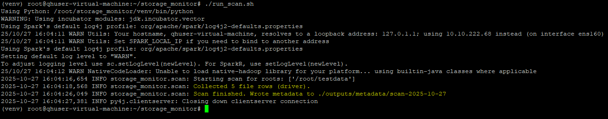
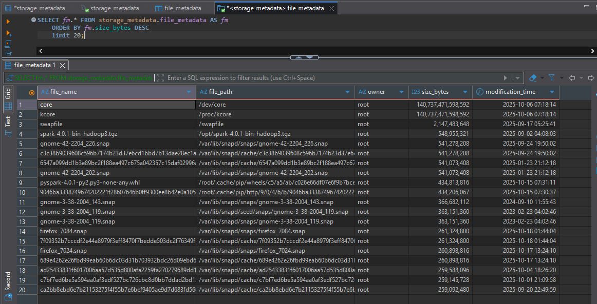
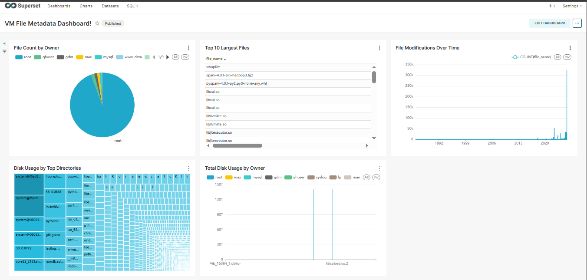

# 🚀 Storage Monitoring & Metadata Pipeline (PySpark + MySQL + Superset)

[]()
[]()
[]()
[]()
[]()

A production-grade system that scans Virtual Machine storage, extracts detailed file metadata, computes hashes, stores Parquet backups, loads metadata into MySQL, and visualizes insights using Apache Superset.

This project is built using:
- **PySpark** for distributed metadata scanning  
- **MySQL** for centralized storage  
- **Superset** for analytics dashboards  
- **Bash** for automation  

Ideal for:
- Storage monitoring  
- Duplicate file detection  
- Capacity planning  
- Infrastructure audits  
- Enterprise server monitoring  
- DevOps & Linux engineering  

---

# 📁 Project Structure

```bash
VM-File-Monitoring-Setup/
│
├── storage_monitor/
│   ├── config.yaml           # Scanner configuration
│   ├── requirements.txt      # Python dependencies
│   ├── run_scan.sh           # Shell wrapper
│   ├── scan_vm_to_mysql.py   # MySQL ingestion pipeline
│   └── scripts/
│       ├── helpers.py        # Hashing utilities
│       └── scan.py           # PySpark metadata scanner
│
├── superset/
│   └── superset_config.py    # Superset backend configuration
│
├── .gitignore
└── README.md
```
---

# ✨ Features
### 1. Distributed File Scanning (PySpark)
- Parallel directory traversal
- Extracts metadata (size, owner, permissions, extension, timestamps, etc.)
- Depth-based directory chunking for faster performance

### 2. Parquet Backup Storage
- Efficient columnar storage
- Can be consumed by Spark, Pandas, Athena, and other analytics engines

### 3. MySQL Metadata Store
- Stores normalized metadata
- Ideal for BI dashboards and analytics
- Scales to millions of file entries

### 4. Superset Dashboard
- Visualize storage usage
- Filter by owner, extension, directory, or scan date
- Identify large files and duplicate candidates

### 5. Configurable & Extensible
- Customize paths, hashing thresholds, log directories, and workers via config.yaml

### 6. Production Ready
- Runs on any Linux VM
- Supports automation via cron
- Resilient and scalable architecture
---

# 🛠 Prerequisites
- Python 3.10+
- Apache Spark 4.x
- MySQL server
- Apache Superset
- Linux environment


# 🚀 Getting Started

## **1. Clone the Repository**
```bash
git clone https://github.com/Durvesh123/VM-File-Monitoring-Setup.git
cd VM-File-Monitoring-Setup/storage_monitor
```
## **2. Create Virtual Environment**
```bash
python3 -m venv venv
source venv/bin/activate
```
## **3. Install Dependencies**
```bash
pip install -r requirements.txt
```
## **4. Configure the Scanner**
Edit config.yaml:
```bash
root_paths:
  - /path/to/scan
max_workers: 4
output_dir: ./outputs/metadata
```
## **5. Run the Metadata Scanner**
```bash
./run_scan.sh
```
This will:
- Scan directories
- Collect metadata
- Hash files
- Save Parquet output

## **6. Load Metadata Into MySQL**
Set environment variables before running:
```bash
export MYSQL_USER="root"
export MYSQL_PASS="yourpassword"
```
Run ingestion:
```bash
python3 scan_vm_to_mysql.py
```
## **7. Visualize in Apache Superset**
Place your Superset configuration:
```bash
superset/superset_config.py
```
Start Superset:
```bash
superset run -p 8088 --with-threads --reload --debugger
```
Then:
- Connect to MySQL
- Import the metadata table
- Build dashboards

# 🧠 How It Works (Architecture Overview)
## **1. Scanner Phase (PySpark)**
The scanner:
- Reads directories in parallel
- Performs lightweight metadata extraction
- Avoids heavy operations until necessary
- Writes output to Parquet


## **2. Duplicate Detection Logic**
| Step | Action |
|------|---------|
| 1    | Compare file size |
| 2    | Compute partial hash |
| 3    | Group by (size, partial hash) |
| 4    | For duplicates → compute full hash |
| 5    | Confirm true duplicates |

## **3. MySQL Ingestion**

The script `scan_vm_to_mysql.py` loads metadata into a MySQL table for analytical queries.
- Suitable for BI
- Efficient indexing possible
- Supports Superset dashboards


## **4. Superset Dashboard**
Visualizes:
- Top largest files
- Count by extensions
- Data by owners
- Daily scans
- Duplicate candidates

Dashboard Preview:



# 🧩 Future Enhancements (Roadmap)

- Real-time scanning via inotify
- S3 / GCS / Azure Blob support
- REST API using FastAPI
- Docker Compose environment
- Alerting system (Slack, Teams, Email)
- RBAC for multi-user access

# 📦 Use Cases
- Enterprise storage monitoring
- DevOps infra audits
- Duplicate file cleanup
- Security review
- Cloud migration prep
- Capacity forecasting
